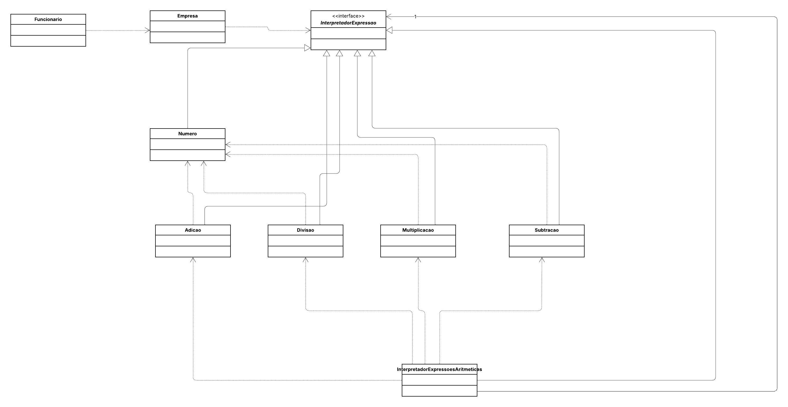

## 💼 Sistema Corporativo de Finanças

Este projeto implementa o padrão de projeto comportamental Interpreter.
O objetivo é criar uma linguagem para definir regras de negócio dinâmicas na classe `Empresa` (como fórmulas de remuneração personalizáveis), e delegar o processamento para o `InterpretadorExpressoesAritmeticas`, que utiliza classes específicas para cada operação (`Adicao`, `Subtracao`, `Multiplicacao`, etc.).
O projeto aplica o princípio Open/Closed (Aberto para extensão, fechado para modificação), permitindo que novas fórmulas ou operações matemáticas sejam interpretadas sem precisar alterar o código da estrutura base do interpretador ou da classe `Funcionario`.

## 📌 Diagrama de Classes

## 👩‍💻 Autora
**Eduarda Araujo Carvalho**
